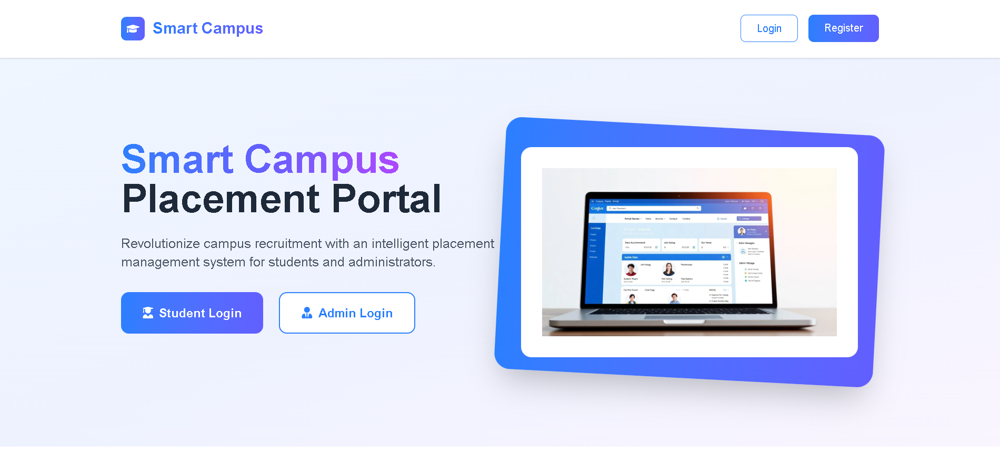
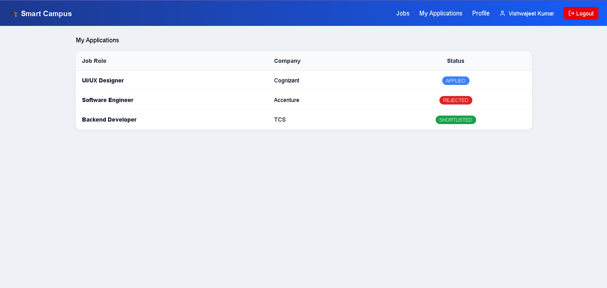
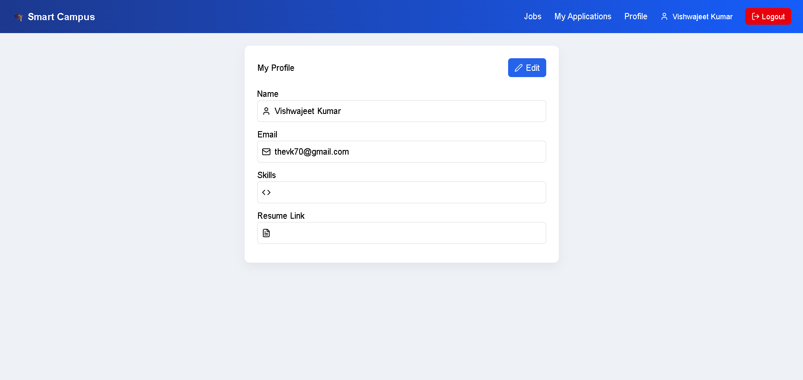
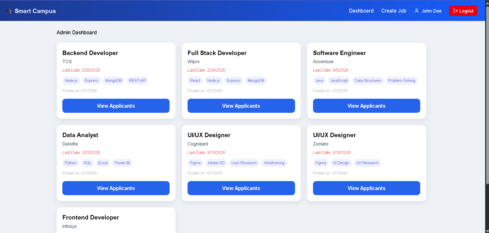
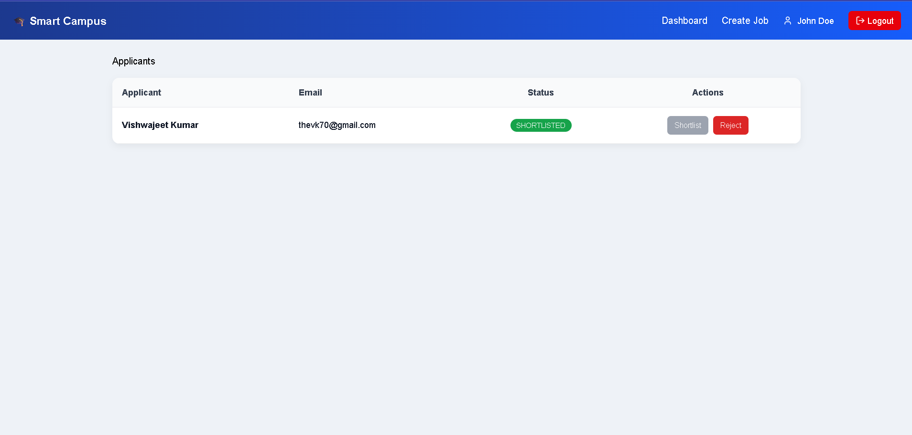
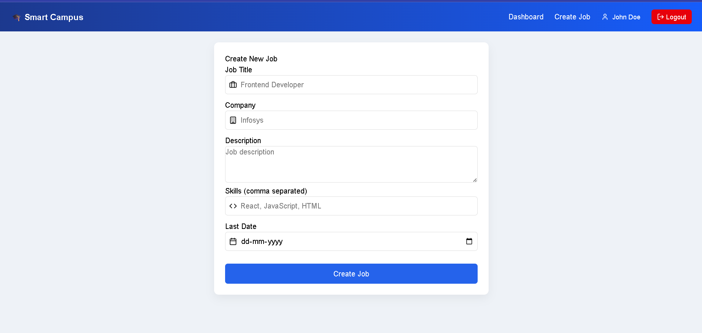

# 🎓 Smart Campus Placement Portal

A full-stack MERN application designed to manage campus placement activities for students and administrators.

The platform allows students to explore job opportunities, apply for jobs, track application status, and manage their profile.  
Admins can post jobs, view applicants, shortlist or reject candidates, and send automated email notifications.

---

## 🚀 Features

### 👩‍🎓 Student Features
- Secure authentication (JWT)
- View available jobs
- Search & filter jobs by title, company, and skills
- Apply for jobs
- Track application status (Applied / Shortlisted / Rejected)
- Manage profile (skills, resume link)
- Responsive dashboard with stats
- Toast notifications & skeleton loaders

### 👨‍💼 Admin Features
- Secure admin authentication
- Create and manage job postings
- View applicants for each job
- Shortlist / reject candidates
- Automated email notifications
- Role-based access control

## 📸 Screenshots








## 🛠 Tech Stack

### Frontend
- React (Vite)
- Zustand (state management)
- React Router
- Lucide React (icons)
- React Hot Toast
- CSS (custom UI)

### Backend
- Node.js
- Express.js
- MongoDB + Mongoose
- JWT Authentication
- Nodemailer (email service)

---

## 📂 Project Structure

### Frontend
src/
├── app/
├── components/
├── pages/
│ ├── auth
│ ├── student
│ └── admin
├── store/
├── services/
└── utils/

### Backend
src/
├── modules/
│ ├── auth
│ ├── job
│ ├── application
│ └── user
├── middlewares
├── models
├── routes.js
└── server.js


---

## 🔐 Authentication & Authorization

- JWT-based authentication
- Role-based access control
  - Students → job browsing & applications
  - Admins → job & application management
- Protected frontend routes

---

## ⚙️ Environment Variables

### Backend `.env`
PORT=5000
MONGO_URI=your_mongodb_connection
JWT_SECRET=your_jwt_secret
EMAIL_USER=your_email
EMAIL_PASS=your_email_app_password


---

## ▶️ Run Locally

### Frontend
cd frontend
npm install
npm run dev

### Backend
```bash
cd backend
npm install
npm run dev

## 🌍 Live Demo
Frontend: https://smart-campus-frontend-cr2y.onrender.com  
Backend: https://smart-campus-backend-dm1q.onrender.com 

## 🔐 Demo Credentials
Admin:
email: admin@gmail.com
password: Admin@123

Student:
email: student@gmail.com
password: Student@123


👤 Author

Vishwajeet Kumar
MCA Student | MERN Stack Developer
